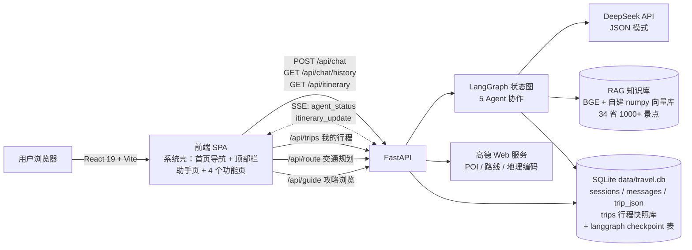
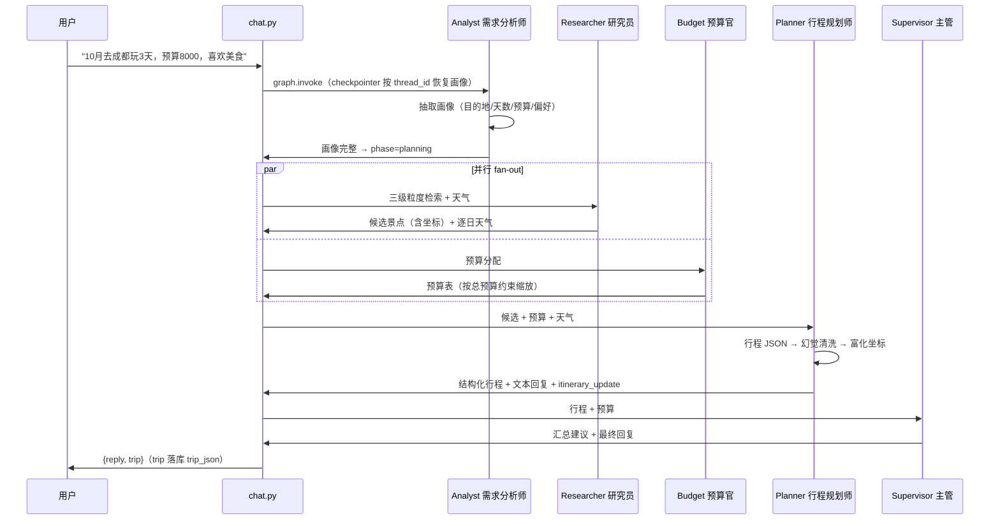
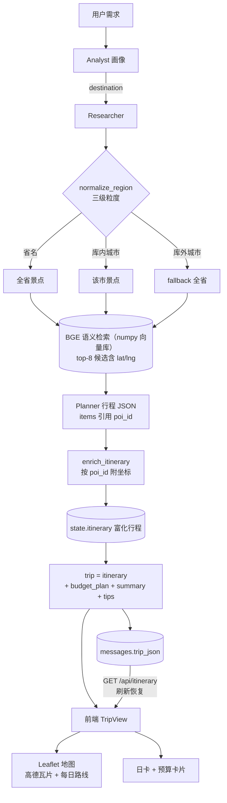

# 架构与协作设计

智能旅行系统 —— 以智能旅行助手（多 Agent）为主功能的 Web 应用。
技术架构、Agent 协作流程、数据流与辅助功能说明。

## 一、系统架构



系统外壳（首页导航式）：打开即系统主页（功能卡片入口），**智能旅行助手为主功能**（C 位大卡），
另有四个独立功能页：我的行程（行程快照库）、交通规划（高德路线）、攻略浏览（语料 + 高德 POI）、
出行清单（纯前端 localStorage）。助手核心链路（LangGraph / SSE / 行程生成）零改动，
仅在行程面板新增「保存到我的行程」按钮。

## 二、Agent 协作流程

## 二、Agent 协作流程



## 三、数据流（检索 → 富化 → 地图）



## 四、关键设计决策

| 主题 | 决策 | 说明 |
|---|---|---|
| 会话持久化 | LangGraph SqliteSaver（thread_id = session_id） | 多轮对话画像延续；修改需求全图重跑 |
| 坐标来源 | RAG 语料（AI 生成示例数据，坐标仅供参考） | 地图标记仅景点；餐厅/酒店为（示例）条目不上地图 |
| 行程富化 | planner 节点内 enrich_itinerary | 一次 HTTP 往返前端拿到完整 trip |
| 回复文本 | 确定性 format_itinerary | LLM 只产出结构化 JSON，文本不依赖 LLM 措辞 |
| 幻觉防御 | 有 poi_id 且不在候选 → 丢弃 | 防止编造景点渲染成真实行程 |
| 实时协作 | SSE agent_status / itinerary_update | Agent 面板实时滚动各节点状态 |

## 五、辅助功能设计

| 功能 | 后端 | 前端 | 数据 |
|---|---|---|---|
| 我的行程 | `/api/trips`（GET 列表/详情、POST 保存、DELETE） | MyTrips + 复用 TripView | trips 表（行程快照库，不影响聊天会话模型） |
| 交通规划 | `/api/route`（高德 geocode + transit/driving/walking；失败 → haversine 估算） | TransportPlanner | 高德路线 API，`source: amap \| estimate` 标注 |
| 攻略浏览 | `/api/guide/cities`、`/api/guide?city=` | Guide（城市 Select + 景点/美食/住宿 Tabs） | 景点 = 高德真实 POI 优先，无结果回退 poi_corpus.jsonl 按 city 过滤；美食/住宿 = 复用 AmapPoiService；无 key 降级 |
| 出行清单 | 无（零后端改动） | Checklist | 预设分类 + 自定义项，勾选状态存 localStorage |

## 六、关键设计决策

| 主题 | 决策 | 说明 |
|---|---|---|
| 会话持久化 | LangGraph SqliteSaver（thread_id = session_id） | 多轮对话画像延续；修改需求全图重跑 |
| 坐标来源 | RAG 语料（AI 生成示例数据，坐标仅供参考） | 地图标记仅景点；餐厅/酒店为（示例）条目不上地图 |
| 行程富化 | planner 节点内 enrich_itinerary | 一次 HTTP 往返前端拿到完整 trip |
| 回复文本 | 确定性 format_itinerary | LLM 只产出结构化 JSON，文本不依赖 LLM 措辞 |
| 幻觉防御 | 有 poi_id 且不在候选 → 丢弃 | 防止编造景点渲染成真实行程 |
| 实时协作 | SSE agent_status / itinerary_update | Agent 面板实时滚动各节点状态 |
| 系统形态 | 首页导航式（view state 切换，不引路由库） | 零新依赖；助手状态提升到顶层，切页不丢会话 |
| 行程快照 | trips 表独立于聊天消息 | 「我的行程」= 只读快照库，不改变助手单会话模型 |
| 交通估算 | 无 key / 失败 → haversine 直线距离 | `source: estimate` 前端 Alert 标注"仅供参考" |
| 攻略降级 | 无 AMAP_KEY → 景点照常、美食/住宿空 | 前端 Empty 提示，不报错 |

## 七、目录结构

```
backend/app/
  agents/       5 个 Agent 节点（analyst/researcher/budget/planner/supervisor）
  rag/          RAG（retriever 三级检索 / vector_store / embeddings / ingest / generate）
  itinerary.py  行程富化（poi_id → 坐标）
  graph.py      LangGraph 装配（checkpointer 注入）
  db.py         表结构 + trips 快照库（create/list/get/delete_trip）
  api/          chat / events(SSE) / sse / amap_poi / amap_route / guide / trips / attraction_image
frontend/src/
  App.tsx       view 状态切换（home | assistant | trips | transport | guide | checklist）
  components/   TopBar（全局导航）/ Home（首页卡片）/ ChatPanel / TripView（地图+日卡）/
                ItineraryMap / AgentProcessPanel / MyTrips / TransportPlanner / Guide / Checklist
  api/          sse（EventSource 封装）
scripts/
  dev.sh        一键启动（--setup 自动准备 RAG）
```
