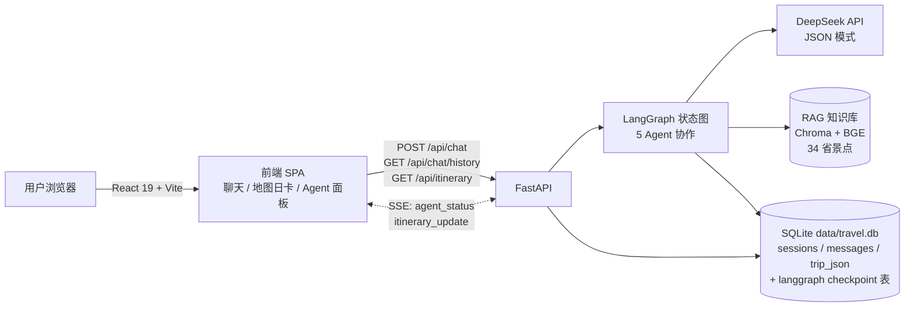
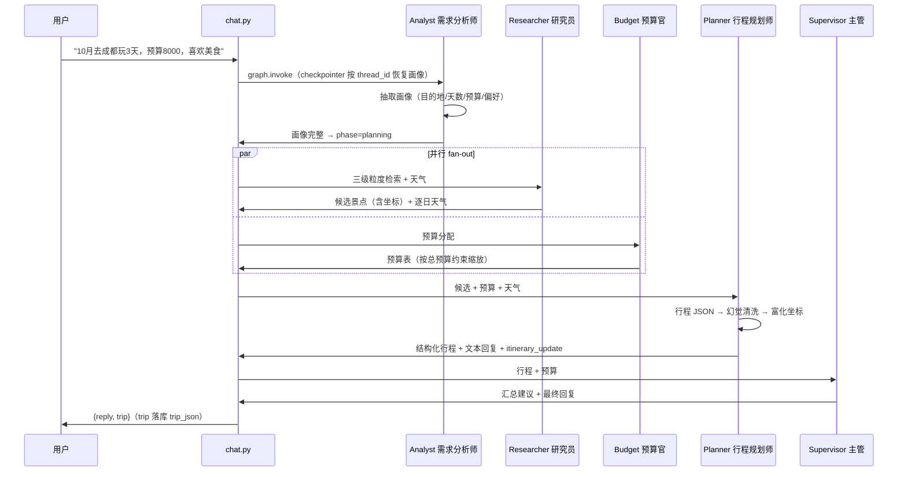
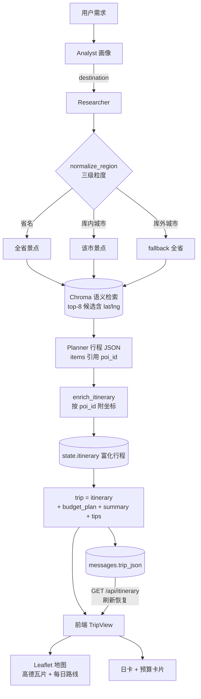

# 架构与协作设计

智能旅行助手（多 Agent）—— 技术架构、Agent 协作流程与数据流说明。

## 一、系统架构



## 二、Agent 协作流程



## 三、数据流（检索 → 富化 → 地图）



## 四、关键设计决策

| 主题 | 决策 | 说明 |
|---|---|---|
| 会话持久化 | LangGraph SqliteSaver（thread_id = session_id） | 多轮对话画像延续；修改需求全图重跑 |
| 坐标来源 | RAG 语料（AI 生成示例数据，坐标仅供参考） | 地图标记仅景点；餐厅/酒店为（示例）条目不上地图 |
| 行程富化 | planner 节点内 enrich_itinerary | 一次 HTTP 往返前端拿到完整 trip |
| 回复文本 | 确定性 format_itinerary | LLM 只产出结构化 JSON，文本不依赖 LLM 措辞 |
| 幻觉防御 | 有 poi_id 且不在候选 → 丢弃 | 防止编造景点渲染成真实行程 |
| 实时协作 | SSE agent_status / itinerary_update | Agent 面板实时滚动各节点状态 |

## 五、目录结构

```
backend/app/
  agents/       5 个 Agent 节点（analyst/researcher/budget/planner/supervisor）
  rag/          RAG（retriever 三级检索 / vector_store / embeddings / ingest / generate）
  itinerary.py  行程富化（poi_id → 坐标）
  graph.py      LangGraph 装配（checkpointer 注入）
  api/          chat / events(SSE) / sse
frontend/src/
  components/   ChatPanel / TripView（地图+日卡）/ ItineraryMap / AgentProcessPanel
  api/          sse（EventSource 封装）
scripts/
  dev.sh        一键启动（--setup 自动准备 RAG）
```
