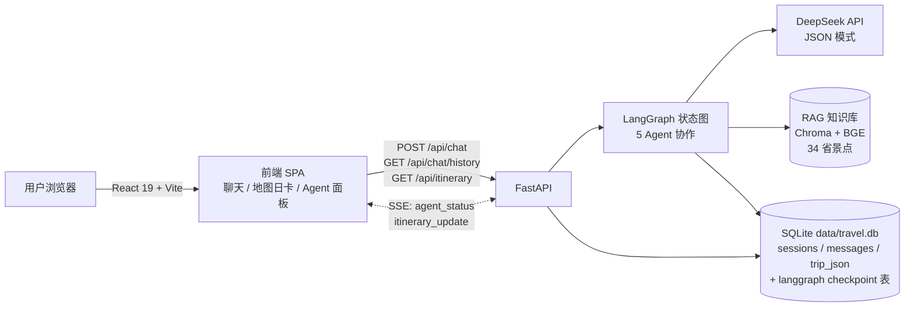
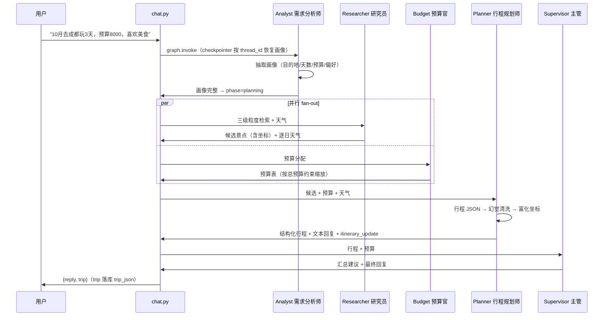
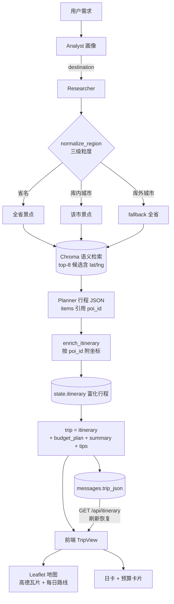

# M5 地图与交付 Implementation Plan

> **For agentic workers:** REQUIRED SUB-SKILL: Use superpowers:subagent-driven-development (recommended) or superpowers:executing-plans to implement this plan task-by-task. Steps use checkbox (`- [ ]`) syntax for tracking.

**Goal:** 行程从纯文本升级为 Leaflet 地图 + 结构化日卡，配一键演示脚本与架构文档，完成作品集交付。

**Architecture:** 后端在 planner 节点内把结构化行程富化（景点条目按 poi_id 附 RAG 候选坐标），chat 响应携带 `trip` 载荷并落库（messages 表 trip_json 列）；新增 `GET /api/itinerary` 供刷新恢复；前端新增 TripView（地图 + 日卡 + 预算卡片）替换最新行程的文本渲染。

**Tech Stack:** Python 3.11+ / FastAPI / LangGraph（现状不变）；前端新增 leaflet + react-leaflet@5 + @types/leaflet；高德瓦片（无 key）；mermaid 架构文档。

**Spec:** [docs/superpowers/specs/2026-08-21-m5-map-delivery-design.md](../specs/2026-08-21-m5-map-delivery-design.md)

## Global Constraints

- DEEPSEEK_API_KEY 绝不显示、绝不写入任何文件、绝不提交（仅 process env 使用；只检查存在性）
- 所有 commit 以 `Co-Authored-By: Claude <noreply@anthropic.com>` 结尾
- 测试全 mock（FakeProvider / fake_weather / FakeEmbedder），无网络、无模型下载、不依赖 backend/data 本机产物
- 仅中国城市；demo copy "10月去成都玩3天，预算8000，喜欢美食"
- 免责声明逐字：`AI 生成示例数据，坐标仅供参考`（地图底部标注）
- 高德瓦片模板逐字：`https://webrd0{s}.is.autonavi.com/appmaptile?lang=zh_cn&size=1&scale=1&style=8&x={x}&y={y}&z={z}`，subdomains `["1","2","3","4"]`，maxZoom 18
- 不做 GCJ-02 坐标转换；餐厅/酒店（无 poi_id 条目）不上地图、仅日卡展示
- 不引入 leaflet/react-leaflet/@types/leaflet 之外的 npm 依赖；不引入新 Python 依赖
- 前端门槛：`npx tsc -b` strict 0 errors + `npm run build` 通过；后端门槛：全量 pytest 通过
- 分支：`feat/m5-map-delivery`（从 main HEAD ca1f553 创建；spec 已在 main）

---

### Task 1: enrich_itinerary 纯函数 + planner 集成 + itinerary_update 事件

**Files:**
- Create: `backend/app/itinerary.py`
- Modify: `backend/app/agents/planner.py`（幻觉清洗后调用 enrich + 发布事件）
- Test: Create `backend/tests/test_itinerary.py`；Modify `backend/tests/test_planner.py`

**Interfaces:**
- Consumes: `itinerary` dict（days[].items[] 含 time/name/poi_id/note）、`candidates` list[dict]（RAG 候选，含 poi_id/lat/lng/name/category/reason/description）
- Produces: `enrich_itinerary(itinerary: dict, candidates: list[dict]) -> dict`——非破坏性返回新结构；`planner_node` 的返回值 `itinerary` 变为富化行程；SSE 事件 `{"type": "itinerary_update", "data": {"status": "generated", "itinerary": <富化行程>}}`

- [ ] **Step 1: 写失败测试**

`backend/tests/test_itinerary.py`：

```python
"""enrich_itinerary：行程条目按 poi_id 附加候选坐标（地图数据链路的起点）。"""
from app.itinerary import enrich_itinerary

CANDIDATES = [
    {"poi_id": "guangzhou-001", "city": "广州", "name": "广州塔",
     "category": "attraction", "lat": 23.1066, "lng": 113.3245,
     "rating": 4.6, "price_tier": 3, "description": "珠江畔地标。", "reason": "夜景绝佳"},
    {"poi_id": "guangzhou-002", "city": "广州", "name": "白云山",
     "category": "attraction", "lat": 23.18, "lng": 113.29},  # 故意缺 description/reason
]

ITINERARY = {
    "days": [{"day": 1, "title": "广州地标", "weather_note": "晴",
              "items": [{"time": "19:00", "name": "广州塔", "poi_id": "guangzhou-001", "note": "夜景"},
                        {"time": "12:30", "name": "点都德（示例）", "note": "午餐"},
                        {"time": "09:00", "name": "未命中景点", "poi_id": "nope-999", "note": ""}]}],
    "summary": "OK", "warnings": [],
}


def test_enrich_attaches_candidate_coords():
    out = enrich_itinerary(ITINERARY, CANDIDATES)
    item = out["days"][0]["items"][0]
    assert item["poi_id"] == "guangzhou-001"
    assert item["lat"] == 23.1066
    assert item["lng"] == 113.3245
    assert item["name"] == "广州塔"        # 富化后 name 取自候选
    assert item["category"] == "attraction"
    assert item["reason"] == "夜景绝佳"
    assert item["description"] == "珠江畔地标。"
    assert item["note"] == "夜景"          # 原字段保留


def test_enrich_keeps_items_without_poi_id():
    out = enrich_itinerary(ITINERARY, CANDIDATES)
    food = out["days"][0]["items"][1]
    assert food == {"time": "12:30", "name": "点都德（示例）", "note": "午餐"}  # 无 poi_id 原样


def test_enrich_keeps_unmatched_poi_id():
    out = enrich_itinerary(ITINERARY, CANDIDATES)
    miss = out["days"][0]["items"][2]
    assert "lat" not in miss and miss["poi_id"] == "nope-999"  # 未命中不附加


def test_enrich_tolerates_missing_candidate_fields():
    out = enrich_itinerary(ITINERARY, CANDIDATES)
    # guangzhou-002 缺 description/reason：构造一个引用它的行程验证字段缺失时不附加
    it = {"days": [{"day": 1, "title": "x", "weather_note": "",
                    "items": [{"time": "09:00", "name": "白云山", "poi_id": "guangzhou-002", "note": ""}]}],
          "summary": "", "warnings": []}
    item = enrich_itinerary(it, CANDIDATES)["days"][0]["items"][0]
    assert item["lat"] == 23.18 and item["lng"] == 113.29
    assert "reason" not in item and "description" not in item


def test_enrich_empty_candidates():
    out = enrich_itinerary(ITINERARY, [])
    assert out["days"][0]["items"][0] == ITINERARY["days"][0]["items"][0]
    assert "lat" not in out["days"][0]["items"][0]


def test_enrich_does_not_mutate_input():
    before = {"time": "19:00", "name": "广州塔", "poi_id": "guangzhou-001", "note": "夜景"}
    itinerary = {"days": [{"day": 1, "title": "t", "weather_note": "",
                           "items": [dict(before)]}], "summary": "", "warnings": []}
    enrich_itinerary(itinerary, CANDIDATES)
    assert itinerary["days"][0]["items"][0] == before  # 入参未被原地修改
```

- [ ] **Step 2: 跑测试确认失败**

Run: `cd backend && .venv/Scripts/python -m pytest tests/test_itinerary.py -q`
Expected: FAIL（`ModuleNotFoundError: No module named 'app.itinerary'`）

- [ ] **Step 3: 实现**

`backend/app/itinerary.py`：

```python
"""行程富化：把 planner 产出的结构化行程与 RAG 候选（含坐标）关联。"""
from __future__ import annotations


def enrich_itinerary(itinerary: dict, candidates: list[dict]) -> dict:
    """给行程条目附加候选景点信息（lat/lng/name/category/reason/description）。

    景点条目按 poi_id 命中候选 → 附加坐标等字段（地图标记用）；
    无 poi_id 的条目（LLM 生成的示例餐饮/住宿，语料无坐标）或未命中 → 原样保留。
    非破坏性：返回新结构、不修改入参（测试 fake 常量共享嵌套 dict，原地改会串用例）。
    """
    by_id = {p.get("poi_id"): p for p in candidates if p.get("poi_id")}
    days = []
    for day in itinerary.get("days") or []:
        items = []
        for item in day.get("items", []):
            cand = by_id.get(item.get("poi_id"))
            if cand is None:
                items.append(dict(item))
                continue
            enriched = dict(item)
            for field in ("lat", "lng", "name", "category", "reason", "description"):
                if cand.get(field) is not None:
                    enriched[field] = cand[field]
            items.append(enriched)
        days.append({**day, "items": items})
    return {**itinerary, "days": days}
```

- [ ] **Step 4: 跑测试确认通过**

Run: `cd backend && .venv/Scripts/python -m pytest tests/test_itinerary.py -q`
Expected: PASS（6 passed）

- [ ] **Step 5: planner 集成——先写失败测试**

`backend/tests/test_planner.py` 文件末尾追加（CANDIDATES/ITINERARY/_state 已是文件内常量，含 lat/lng）：

```python
def test_planner_enriches_itinerary_with_candidate_coords():
    fake = _fake()
    out = planner.planner_node(_state(), fake)  # type: ignore[arg-type]
    item = out["itinerary"]["days"][0]["items"][0]
    assert item["poi_id"] == "guangzhou-001"
    assert item["lat"] == 23.1066 and item["lng"] == 113.3245
    food = out["itinerary"]["days"][0]["items"][1]
    assert "lat" not in food  # 示例餐饮无坐标，不上地图


def test_planner_publishes_itinerary_update(monkeypatch):
    published: list[dict] = []
    monkeypatch.setattr("app.agents.planner.events.publish", lambda p: published.append(p))
    fake = _fake()
    planner.planner_node(_state(), fake)  # type: ignore[arg-type]
    updates = [p for p in published if p["type"] == "itinerary_update"]
    assert len(updates) == 1
    assert updates[0]["data"]["status"] == "generated"
    assert updates[0]["data"]["itinerary"]["days"][0]["items"][0]["lat"] == 23.1066
```

- [ ] **Step 6: 跑测试确认失败**

Run: `cd backend && .venv/Scripts/python -m pytest tests/test_planner.py::test_planner_enriches_itinerary_with_candidate_coords tests/test_planner.py::test_planner_publishes_itinerary_update -q`
Expected: FAIL（KeyError 'lat' / 无 itinerary_update 事件）

- [ ] **Step 7: planner.py 集成**

`backend/app/agents/planner.py` 顶部 import 区（`from app import events` 之后）加：

```python
from app.itinerary import enrich_itinerary
```

幻觉清洗块之后、`if itinerary.get("days") is None:` 之前插入富化；`events.publish(agent_status done)` 行替换为富化事件发布。修改后的结尾段为：

```python
    # 幻觉清洗：有 poi_id 且不在候选集合 → 丢弃；无 poi_id → 保留（示例餐饮/住宿）
    candidate_ids = {p.get("poi_id") for p in candidates if p.get("poi_id")}
    for day in itinerary.get("days") or []:
        kept = []
        for item in day.get("items", []):
            pid = item.get("poi_id")
            if pid is not None and pid not in candidate_ids:
                continue  # 编造的 POI 直接丢弃
            kept.append(item)
        day["items"] = kept

    # M5：富化行程（景点条目按 poi_id 附候选坐标），供前端地图/日卡与 trip 落库
    itinerary = enrich_itinerary(itinerary, candidates)

    if itinerary.get("days") is None:
        # days: null 不做 markdown 格式化，降级为摘要回复（T8-F4 回归）
        reply = f"行程总结：{itinerary.get('summary', '')}"
    else:
        reply = format_itinerary(itinerary)
    events.publish({"type": "agent_status", "data": {"agent": "planner", "status": "done"}})
    events.publish({"type": "itinerary_update",
                    "data": {"status": "generated", "itinerary": itinerary}})
    return {"phase": "answered", "itinerary": itinerary, "last_reply": reply}
```

- [ ] **Step 8: 跑测试确认通过 + 全量回归**

Run: `cd backend && .venv/Scripts/python -m pytest tests/test_planner.py tests/test_itinerary.py -q`
Expected: PASS（16 passed = test_planner 10 + test_itinerary 6）
Run: `cd backend && .venv/Scripts/python -m pytest tests/ -q`
Expected: PASS（113 passed = M4 基线 105 + 8 新增；planner 富化不改变文本回复）

- [ ] **Step 9: Commit**

```bash
cd backend && git add app/itinerary.py app/agents/planner.py tests/test_itinerary.py tests/test_planner.py
git commit -m "feat: enrich itinerary with candidate coords + itinerary_update event

Co-Authored-By: Claude <noreply@anthropic.com>"
```

---

### Task 2: trip 落库 + chat 响应 + GET /api/itinerary

**Files:**
- Modify: `backend/app/db.py`（trip_json 列 + 迁移 + get_latest_trip）、`backend/app/api/chat.py`（_build_trip + 响应 + 新端点）
- Test: Modify `backend/tests/test_db.py`、`backend/tests/test_chat.py`

**Interfaces:**
- Consumes: Task 1 的 `result["itinerary"]`（已富化）、`result["budget_plan"]`、`result["supervisor_summary"]`（{"summary", "tips"}）
- Produces: `db.add_message(sid, role, content, trip_json: str | None = None)`（向后兼容，原 3 参调用不变）；`db.get_latest_trip(sid) -> dict | None`；`POST /api/chat` 响应 `{"session_id", "reply", "trip"}`（trip 为 `{"itinerary", "budget_plan", "summary", "tips"}` 或 null）；`GET /api/itinerary?session_id=` → `{"session_id", "trip"}` / 404

- [ ] **Step 1: 写失败测试（db 层）**

`backend/tests/test_db.py` 顶部加 `import json`；文件末尾追加：

```python
def test_add_message_with_trip_and_get_latest(tmp_db):
    sid = db.create_session()
    db.add_message(sid, "user", "你好")
    db.add_message(sid, "assistant", "回复1")
    db.add_message(sid, "user", "第二天换成博物馆")
    trip = {"itinerary": {"days": [{"day": 1, "title": "博物馆日", "weather_note": "",
                                    "items": []}]}, "budget_plan": {"items": [], "total": None}}
    db.add_message(sid, "assistant", "回复2", trip_json=json.dumps(trip, ensure_ascii=False))
    assert db.get_latest_trip(sid) == trip  # 最新一条非空 trip


def test_get_latest_trip_none_without_trip(tmp_db):
    sid = db.create_session()
    db.add_message(sid, "user", "你好")
    db.add_message(sid, "assistant", "好的")
    assert db.get_latest_trip(sid) is None


def test_get_latest_trip_unknown_session_none(tmp_db):
    assert db.get_latest_trip("nope") is None


def test_migration_adds_trip_json_column(tmp_path, monkeypatch):
    """M4 前旧库（无 trip_json 列）→ init_db 自动 ALTER 补列，既有数据不破坏。"""
    import sqlite3
    db_path = tmp_path / "old.db"
    monkeypatch.setenv("TRAVEL_DB_PATH", str(db_path))
    conn = sqlite3.connect(db_path)
    conn.executescript("""
        CREATE TABLE sessions (
            id TEXT PRIMARY KEY,
            created_at TEXT NOT NULL DEFAULT (datetime('now'))
        );
        CREATE TABLE messages (
            id INTEGER PRIMARY KEY AUTOINCREMENT,
            session_id TEXT NOT NULL REFERENCES sessions(id),
            role TEXT NOT NULL,
            content TEXT NOT NULL,
            created_at TEXT NOT NULL DEFAULT (datetime('now'))
        );
        INSERT INTO sessions (id) VALUES ('oldsid');
        INSERT INTO messages (session_id, role, content) VALUES ('oldsid', 'user', '旧消息');
    """)
    conn.commit()
    conn.close()
    db.init_db()
    conn = sqlite3.connect(db_path)
    cols = {r[1] for r in conn.execute("PRAGMA table_info(messages)")}
    conn.close()
    assert "trip_json" in cols
    assert db.list_messages("oldsid") == [{"role": "user", "content": "旧消息"}]
```

- [ ] **Step 2: 跑测试确认失败**

Run: `cd backend && .venv/Scripts/python -m pytest tests/test_db.py -q`
Expected: FAIL（TypeError: add_message() takes 3 positional arguments but 4 were given / AttributeError get_latest_trip）

- [ ] **Step 3: 实现 db.py**

`backend/app/db.py` 顶部加 `import json`；SCHEMA 的 messages 建表加列；init_db 加迁移；add_message 加参数；文件末尾加 get_latest_trip。逐处修改：

SCHEMA 改为：

```python
SCHEMA = """
CREATE TABLE IF NOT EXISTS sessions (
    id TEXT PRIMARY KEY,
    created_at TEXT NOT NULL DEFAULT (datetime('now'))
);
CREATE TABLE IF NOT EXISTS messages (
    id INTEGER PRIMARY KEY AUTOINCREMENT,
    session_id TEXT NOT NULL REFERENCES sessions(id),
    role TEXT NOT NULL,
    content TEXT NOT NULL,
    trip_json TEXT,
    created_at TEXT NOT NULL DEFAULT (datetime('now'))
);
"""
```

init_db 改为：

```python
def init_db() -> None:
    conn = get_conn()
    try:
        conn.executescript(SCHEMA)
        # M4 前旧库迁移：messages 表缺 trip_json 列 → ALTER 补列（既有数据不破坏）
        cols = {r[1] for r in conn.execute("PRAGMA table_info(messages)")}
        if "trip_json" not in cols:
            conn.execute("ALTER TABLE messages ADD COLUMN trip_json TEXT")
        conn.commit()
    finally:
        conn.close()
```

add_message 改为：

```python
def add_message(sid: str, role: str, content: str, trip_json: str | None = None) -> None:
    conn = get_conn()
    try:
        conn.execute(
            "INSERT INTO messages (session_id, role, content, trip_json) VALUES (?, ?, ?, ?)",
            (sid, role, content, trip_json),
        )
        conn.commit()
    finally:
        conn.close()
```

文件末尾追加：

```python
def get_latest_trip(sid: str) -> dict | None:
    """最新一条非空结构化行程（重排语义：仅最新行程有效，旧行程被整体覆盖）。"""
    conn = get_conn()
    try:
        row = conn.execute(
            "SELECT trip_json FROM messages WHERE session_id = ? AND trip_json IS NOT NULL "
            "ORDER BY id DESC LIMIT 1",
            (sid,),
        ).fetchone()
    finally:
        conn.close()
    return json.loads(row["trip_json"]) if row else None
```

- [ ] **Step 4: 跑测试确认通过**

Run: `cd backend && .venv/Scripts/python -m pytest tests/test_db.py -q`
Expected: PASS（7 passed）

- [ ] **Step 5: 写失败测试（chat 层）**

`backend/tests/test_chat.py` 改动：

1. 顶部 `ITINERARY` 常量的景点条目改为引用候选中的 guangzhou-001（原 chengdu-001 会被幻觉清洗丢弃，trip 断言无意义；候选来自 test_researcher.CANDIDATES 的广州候选）：

```python
ITINERARY = {
    "days": [{"day": 1, "title": "广州地标", "weather_note": "晴",
              "items": [{"time": "19:00", "name": "广州塔", "poi_id": "guangzhou-001", "note": "夜景"}]}],
    "summary": "OK", "warnings": [],
}
```

2. 文件末尾追加新测试：

```python
def test_chat_response_includes_trip(client):
    r = client.post("/api/chat", json={"message": "10月去广州玩3天预算8000"}).json()
    trip = r["trip"]
    assert trip is not None
    item = trip["itinerary"]["days"][0]["items"][0]
    assert item["poi_id"] == "guangzhou-001"
    assert item["lat"] == 23.1066 and item["lng"] == 113.3245  # 富化坐标
    assert trip["budget_plan"]["total"] == 8000
    assert trip["summary"] == "整体节奏合理。"
    assert trip["tips"] == ["周三起降温"]


def test_chat_asking_round_trip_is_null(client):
    """追问轮（画像不完整 → analyst 追问后 END）→ trip 为 null。"""
    client.app.state.provider.json_responses["最新需求"] = {
        "destination": None, "duration_days": 3, "start_date": None,
        "budget_cny": 8000, "travelers": 2, "preferences": ["美食"],
        "missing": ["destination"],
    }
    r = client.post("/api/chat", json={"message": "帮我规划3天"}).json()
    assert r["trip"] is None
    assert "想去哪个城市" in r["reply"]


def test_itinerary_endpoint_returns_latest_trip(client):
    r1 = client.post("/api/chat", json={"message": "10月去广州玩3天预算8000"}).json()
    r2 = client.post("/api/chat", json={"session_id": r1["session_id"], "message": "第二天换成博物馆"}).json()
    resp = client.get(f"/api/itinerary?session_id={r1['session_id']}")
    assert resp.status_code == 200
    assert resp.json()["trip"]["itinerary"] == r2["trip"]["itinerary"]  # 最新行程（重排后）


def test_itinerary_endpoint_unknown_session_404(client):
    resp = client.get("/api/itinerary?session_id=deadbeef")
    assert resp.status_code == 404


def test_itinerary_endpoint_session_without_trip_404(client):
    """追问轮会话从未产出行程 → 404（前端静默回退文本渲染）。"""
    client.app.state.provider.json_responses["最新需求"] = {
        "destination": None, "duration_days": 3, "start_date": None,
        "budget_cny": 8000, "travelers": 2, "preferences": [],
        "missing": ["destination"],
    }
    r = client.post("/api/chat", json={"message": "帮我规划"}).json()
    resp = client.get(f"/api/itinerary?session_id={r['session_id']}")
    assert resp.status_code == 404
```

- [ ] **Step 6: 跑测试确认失败**

Run: `cd backend && .venv/Scripts/python -m pytest tests/test_chat.py -q`
Expected: FAIL（'trip' KeyError / 404 断言失败）

- [ ] **Step 7: 实现 chat.py**

`backend/app/api/chat.py`：顶部 import 区加 `import json`（`import sqlite3` 之前，字母序）；`_graph_for_request` 之后加 `_build_trip`；chat 端点组装 trip + 落库 + 返回；文件末尾加新端点。

`_build_trip`（加在 `_graph_for_request` 函数之后）：

```python
def _build_trip(result: dict) -> dict | None:
    """组装前端 trip 载荷：结构化行程 + 预算 + 汇总建议。

    追问轮/降级回复（无 itinerary 或 days 为空）→ None，前端回退纯文本渲染。
    """
    itinerary = result.get("itinerary")
    if not itinerary or not itinerary.get("days"):
        return None
    summary = result.get("supervisor_summary") or {}
    return {
        "itinerary": itinerary,
        "budget_plan": result.get("budget_plan") or {},
        "summary": summary.get("summary") or "",
        "tips": summary.get("tips") or [],
    }
```

chat 端点尾段（`db.add_message(sid, "assistant", reply)` 与 `return {...}` 两行）替换为：

```python
    trip = _build_trip(result)
    db.add_message(
        sid, "assistant", reply,
        trip_json=json.dumps(trip, ensure_ascii=False) if trip else None,
    )
    return {"session_id": sid, "reply": reply, "trip": trip}
```

文件末尾追加：

```python
@router.get("/api/itinerary")
async def itinerary(session_id: str):
    """最新一条结构化行程（刷新后恢复地图/日卡）；无会话或无行程 → 404。"""
    if db.get_session(session_id) is None:
        raise HTTPException(status_code=404, detail="会话不存在")
    trip = db.get_latest_trip(session_id)
    if trip is None:
        raise HTTPException(status_code=404, detail="该会话暂无行程")
    return {"session_id": session_id, "trip": trip}
```

- [ ] **Step 8: 跑测试确认通过 + 全量回归**

Run: `cd backend && .venv/Scripts/python -m pytest tests/test_chat.py tests/test_db.py -q`
Expected: PASS（test_chat 14 passed = 9 存量 + 5 新增；test_db 7 passed = 3 存量 + 4 新增）
Run: `cd backend && .venv/Scripts/python -m pytest tests/ -q`
Expected: PASS（122 passed = 113 基线 + 9 新增）

- [ ] **Step 9: Commit**

```bash
cd backend && git add app/db.py app/api/chat.py tests/test_db.py tests/test_chat.py
git commit -m "feat: chat response carries trip; trip_json persistence + itinerary endpoint

Co-Authored-By: Claude <noreply@anthropic.com>"
```

---

### Task 3: 前端 TripView（地图 + 日卡）+ App 集成

**Files:**
- Create: `frontend/src/components/ItineraryMap.tsx`、`frontend/src/components/TripView.tsx`
- Modify: `frontend/src/App.tsx`（整文件替换）、`frontend/src/main.tsx`（加 leaflet CSS）、`frontend/package.json`（npm install 自动写入）
- Test: `npx tsc -b` + `npm run build`

**Interfaces:**
- Consumes: `POST /api/chat` 响应 `trip`（Task 2 形状：`{itinerary: {days: [{day, title, weather_note, items: [{time, name, note, poi_id?, lat?, lng?}]}]}, budget_plan: {items?, total?}, summary, tips}`）；`GET /api/itinerary?session_id=` 响应 `{session_id, trip}`
- Produces: `TripView`（props `{trip: Trip, reply: string}`）、`ItineraryMap`（props `{days: DayGeo[], activeDay: number | "all"}`）、`Trip` 类型导出（App.tsx 使用）

- [ ] **Step 1: 安装依赖**

Run: `cd frontend && npm install leaflet react-leaflet @types/leaflet`
Expected: package.json 写入 `"leaflet": "^1.9.x"`、`"react-leaflet": "^5.x"`、devDependencies `"@types/leaflet": "^1.9.x"`

- [ ] **Step 2: 创建 ItineraryMap.tsx**

`frontend/src/components/ItineraryMap.tsx` 完整内容：

```tsx
import { useEffect, useMemo } from "react";
import { MapContainer, Marker, Polyline, Popup, TileLayer, useMap } from "react-leaflet";
import L from "leaflet";

export interface MapPoint {
  name: string;
  lat: number;
  lng: number;
  time?: string;
  note?: string;
}

export interface DayGeo {
  day: number;
  title?: string;
  points: MapPoint[];
}

// 高德瓦片（无 key；GCJ-02 与语料近似坐标的偏移由"坐标仅供参考"免责声明覆盖）
const TILE_URL =
  "https://webrd0{s}.is.autonavi.com/appmaptile?lang=zh_cn&size=1&scale=1&style=8&x={x}&y={y}&z={z}";

// 自定义 divIcon：bundler 下 Leaflet 默认 marker 图标资源会 404，圆形编号标记规避
function makeIcon(day: number, index: number) {
  return L.divIcon({
    className: "",
    html: `<div style="background:#2563eb;color:#fff;border-radius:9999px;width:20px;height:20px;display:flex;align-items:center;justify-content:center;font-size:11px;border:2px solid #fff;box-shadow:0 1px 3px rgba(0,0,0,.4)">${day}-${index + 1}</div>`,
    iconSize: [20, 20],
    iconAnchor: [10, 10],
  });
}

function FitBounds({ points }: { points: MapPoint[] }) {
  const map = useMap();
  useEffect(() => {
    if (!points.length) return;
    const bounds = L.latLngBounds(points.map((p) => [p.lat, p.lng] as [number, number]));
    map.fitBounds(bounds, { padding: [30, 30], maxZoom: 13 });
  }, [map, points]);
  return null;
}

interface Props {
  days: DayGeo[];
  activeDay: number | "all";
}

export default function ItineraryMap({ days, activeDay }: Props) {
  const visibleDays = useMemo(
    () => (activeDay === "all" ? days : days.filter((d) => d.day === activeDay)),
    [days, activeDay],
  );
  const points = useMemo(() => visibleDays.flatMap((d) => d.points), [visibleDays]);

  return (
    <div className="relative h-full w-full">
      <MapContainer center={[35, 105]} zoom={4} className="h-full w-full" scrollWheelZoom={false}>
        <TileLayer
          url={TILE_URL}
          subdomains={["1", "2", "3", "4"]}
          maxZoom={18}
          attribution="© 高德地图"
        />
        <FitBounds points={points} />
        {visibleDays.map((d) =>
          d.points.map((p, i) => (
            <Marker key={`${d.day}-${i}`} position={[p.lat, p.lng]} icon={makeIcon(d.day, i)}>
              <Popup>
                <div className="text-xs">
                  <p className="font-semibold">{p.name}</p>
                  {p.time && <p>🕐 {p.time}</p>}
                  {p.note && <p>{p.note}</p>}
                </div>
              </Popup>
            </Marker>
          )),
        )}
        {visibleDays.map((d) =>
          d.points.length >= 2 ? (
            <Polyline
              key={`line-${d.day}`}
              positions={d.points.map((p) => [p.lat, p.lng] as [number, number])}
              pathOptions={{ color: "#2563eb", weight: 3, dashArray: "6 4" }}
            />
          ) : null,
        )}
      </MapContainer>
      <p className="absolute bottom-0 left-0 z-[1000] rounded-tr bg-white/90 px-2 py-0.5 text-[10px] text-slate-500">
        AI 生成示例数据，坐标仅供参考
      </p>
    </div>
  );
}
```

- [ ] **Step 3: 创建 TripView.tsx**

`frontend/src/components/TripView.tsx` 完整内容：

```tsx
import { useMemo, useState } from "react";
import ItineraryMap, { type DayGeo } from "./ItineraryMap";

export interface TripItem {
  time?: string;
  name: string;
  note?: string;
  poi_id?: string;
  lat?: number;
  lng?: number;
  category?: string;
}

export interface TripDay {
  day: number;
  title?: string;
  weather_note?: string;
  items: TripItem[];
}

export interface Trip {
  itinerary: { days: TripDay[]; summary?: string; warnings?: string[] };
  budget_plan: {
    items?: { category: string; amount: number; note?: string }[];
    total?: number | null;
  };
  summary?: string;
  tips?: string[];
}

interface Props {
  trip: Trip;
  reply: string;
}

export default function TripView({ trip, reply }: Props) {
  const days = trip.itinerary.days ?? [];
  const [activeDay, setActiveDay] = useState<number | "all">("all");

  // 只有带坐标的景点条目上地图（餐厅/酒店为（示例）条目，语料无坐标）
  const geoDays: DayGeo[] = useMemo(
    () =>
      days.map((d) => ({
        day: d.day,
        title: d.title,
        points: (d.items ?? [])
          .filter(
            (it): it is TripItem & { lat: number; lng: number } =>
              typeof it.lat === "number" && typeof it.lng === "number",
          )
          .map((it) => ({ name: it.name, lat: it.lat, lng: it.lng, time: it.time, note: it.note })),
      })),
    [days],
  );

  const budget = trip.budget_plan ?? {};
  const visibleDays = activeDay === "all" ? days : days.filter((d) => d.day === activeDay);

  return (
    <div className="space-y-4">
      {/* 按天过滤 tabs */}
      <div className="flex flex-wrap gap-2">
        <button
          className={`rounded-full px-3 py-1 text-xs ${activeDay === "all" ? "bg-blue-600 text-white" : "bg-white text-slate-600 border border-slate-300"}`}
          onClick={() => setActiveDay("all")}
        >
          全部
        </button>
        {days.map((d) => (
          <button
            key={d.day}
            className={`rounded-full px-3 py-1 text-xs ${activeDay === d.day ? "bg-blue-600 text-white" : "bg-white text-slate-600 border border-slate-300"}`}
            onClick={() => setActiveDay(d.day)}
          >
            第{d.day}天
          </button>
        ))}
      </div>

      {/* 地图 */}
      <div className="h-[40vh] min-h-64 overflow-hidden rounded-xl border border-slate-200">
        <ItineraryMap days={geoDays} activeDay={activeDay} />
      </div>

      {/* 日卡 */}
      <div className="grid gap-3">
        {visibleDays.map((d) => (
          <div key={d.day} className="rounded-xl border border-slate-200 bg-white p-4">
            <h3 className="font-semibold text-slate-800">第 {d.day} 天：{d.title ?? ""}</h3>
            {d.weather_note && <p className="mt-0.5 text-xs text-slate-500">🌤 {d.weather_note}</p>}
            <ul className="mt-3 space-y-2">
              {(d.items ?? []).map((it, i) => (
                <li key={i} className="flex gap-2 text-sm">
                  <span className="shrink-0 font-mono text-slate-400">{it.time ?? "--:--"}</span>
                  <span className="text-slate-800">{it.name}</span>
                  {it.note && <span className="self-center text-xs text-slate-500">（{it.note}）</span>}
                </li>
              ))}
            </ul>
          </div>
        ))}
      </div>

      {/* 预算卡片 */}
      {budget.items?.length ? (
        <div className="rounded-xl border border-slate-200 bg-white p-4">
          <h3 className="mb-2 font-semibold text-slate-800">预算分配</h3>
          <table className="w-full text-sm">
            <tbody>
              {budget.items.map((it, i) => (
                <tr key={i} className="border-b border-slate-100 last:border-0">
                  <td className="py-1.5">{it.category}</td>
                  <td className="py-1.5 text-xs text-slate-500">{it.note}</td>
                  <td className="py-1.5 text-right font-mono">{it.amount}</td>
                </tr>
              ))}
              {budget.total != null && (
                <tr>
                  <td className="py-1.5 font-semibold">合计</td>
                  <td />
                  <td className="py-1.5 text-right font-mono font-semibold">{budget.total}</td>
                </tr>
              )}
            </tbody>
          </table>
        </div>
      ) : null}

      {/* 总结 + tips */}
      {trip.summary || trip.tips?.length ? (
        <div className="rounded-xl border border-slate-200 bg-white p-4 text-sm">
          {trip.summary && <p className="text-slate-800">{trip.summary}</p>}
          {trip.tips?.length ? (
            <ul className="mt-2 space-y-1">
              {trip.tips.map((t, i) => (
                <li key={i} className="text-slate-600">💡 {t}</li>
              ))}
            </ul>
          ) : null}
        </div>
      ) : null}

      {/* 完整文本回复折叠 */}
      <details className="rounded-xl border border-slate-200 bg-white p-4 text-sm">
        <summary className="cursor-pointer select-none text-xs text-slate-500">查看完整文本回复</summary>
        <div className="mt-2 whitespace-pre-wrap text-slate-800">{reply}</div>
      </details>
    </div>
  );
}
```

- [ ] **Step 4: main.tsx 加 Leaflet CSS**

`frontend/src/main.tsx` 完整替换为：

```tsx
import { StrictMode } from 'react'
import { createRoot } from 'react-dom/client'
import 'leaflet/dist/leaflet.css'
import './index.css'
import App from './App.tsx'

createRoot(document.getElementById('root')!).render(
  <StrictMode>
    <App />
  </StrictMode>,
)
```

- [ ] **Step 5: App.tsx 集成**

`frontend/src/App.tsx` 完整替换为：

```tsx
import { useEffect, useState } from "react";
import AgentProcessPanel from "./components/AgentProcessPanel";
import ChatPanel from "./components/ChatPanel";
import TripView, { type Trip } from "./components/TripView";
import { connectSse, type ProcessEvent } from "./api/sse";

interface ChatMessage {
  role: "user" | "assistant";
  content: string;
}

const SESSION_KEY = "travel_session_id";

function App() {
  const [events, setEvents] = useState<ProcessEvent[]>([]);
  const [messages, setMessages] = useState<ChatMessage[]>([]);
  const [trip, setTrip] = useState<Trip | null>(null);
  // session_id 持久化到 localStorage：刷新页面后恢复会话（历史消息 + 画像延续）
  const [sessionId, setSessionId] = useState<string | null>(
    () => localStorage.getItem(SESSION_KEY),
  );
  const [sending, setSending] = useState(false);

  useEffect(() => {
    return connectSse((ev) => setEvents((prev) => [...prev, ev].slice(-50)));
  }, []);

  // 刷新后恢复历史消息与最新行程；失败（后端未启动/会话过期）静默降级为空会话
  useEffect(() => {
    const sid = localStorage.getItem(SESSION_KEY);
    if (!sid) return;
    fetch(`/api/chat/history?session_id=${encodeURIComponent(sid)}`)
      .then((resp) => (resp.ok ? resp.json() : null))
      .then((data) => {
        // 挂载竞态防护：history 返回前用户已极速首发消息（本地已入 state），
        // 此时只补历史、不整组覆盖（否则首条用户消息被历史数据冲掉）
        if (data?.messages?.length) {
          setMessages((prev) => (prev.length ? prev : data.messages));
        }
      })
      .catch(() => {});
    // 地图/日卡恢复：取最新一条结构化行程；无行程（404）→ 保持纯文本渲染
    fetch(`/api/itinerary?session_id=${encodeURIComponent(sid)}`)
      .then((resp) => (resp.ok ? resp.json() : null))
      .then((data) => {
        if (data?.trip) setTrip(data.trip);
      })
      .catch(() => {});
  }, []);

  const handleSend = async (text: string) => {
    setMessages((prev) => [...prev, { role: "user", content: text }]);
    setSending(true);
    try {
      const resp = await fetch("/api/chat", {
        method: "POST",
        headers: { "Content-Type": "application/json" },
        body: JSON.stringify({ message: text, session_id: sessionId }),
      });
      if (!resp.ok) {
        const err = await resp.json().catch(() => null);
        throw new Error(err?.detail ?? `请求失败 (${resp.status})`);
      }
      const data = await resp.json();
      localStorage.setItem(SESSION_KEY, data.session_id);
      setSessionId(data.session_id);
      setTrip(data.trip ?? null);
      setMessages((prev) => [
        ...prev,
        { role: "assistant", content: data.reply },
      ]);
    } catch (err) {
      setMessages((prev) => [
        ...prev,
        {
          role: "assistant",
          content: `⚠️ ${err instanceof Error ? err.message : String(err)}`,
        },
      ]);
    } finally {
      setSending(false);
    }
  };

  // 最新一条 assistant 消息且有结构化行程 → TripView；其余历史消息仍文本
  const lastAssistantIdx = messages.map((m) => m.role).lastIndexOf("assistant");

  return (
    <div className="h-screen flex bg-slate-50">
      <div className="w-80 border-r border-slate-200 bg-white flex flex-col">
        <ChatPanel onSend={handleSend} disabled={sending} />
      </div>
      <main className="flex-1 p-6 overflow-y-auto">
        <h1 className="text-xl font-bold text-slate-800 mb-4">智能旅行助手</h1>
        {messages.length === 0 ? (
          <p className="text-sm text-slate-500">
            输入出行需求，例如"10月去成都玩3天，预算8000，喜欢美食"。
            生成的行程将以地图与日卡展示。
          </p>
        ) : (
          <div className="space-y-4">
            {messages.map((m, i) =>
              m.role === "user" ? (
                <div
                  key={i}
                  className="text-sm text-slate-700 bg-white rounded-lg p-3 border border-slate-200 ml-16"
                >
                  {m.content}
                </div>
              ) : i === lastAssistantIdx && trip ? (
                <TripView key={i} trip={trip} reply={m.content} />
              ) : (
                <div
                  key={i}
                  className="text-sm text-slate-800 bg-white rounded-lg p-4 border border-slate-200 whitespace-pre-wrap"
                >
                  {m.content}
                </div>
              ),
            )}
            {sending && (
              <p className="text-xs text-slate-400">Agent 正在协作处理…</p>
            )}
          </div>
        )}
      </main>
      <AgentProcessPanel events={events} />
    </div>
  );
}

export default App;
```

- [ ] **Step 6: 验证**

Run: `cd frontend && npx tsc -b`
Expected: 0 errors（exit 0）
Run: `cd frontend && npm run build`
Expected: vite build 成功
注意：AgentProcessPanel.tsx 已处理 `itinerary_update` 事件（渲染"行程已更新（将在主区域展示）"），无需改动（spec §三.10 为条件项，条件不成立）

- [ ] **Step 7: Commit**

```bash
git add frontend/src/components/ItineraryMap.tsx frontend/src/components/TripView.tsx frontend/src/App.tsx frontend/src/main.tsx frontend/package.json frontend/package-lock.json
git commit -m "feat: itinerary map (Amap tiles) + structured day cards + trip restore

Co-Authored-By: Claude <noreply@anthropic.com>"
```

---

### Task 4: 一键脚本 + 架构文档 + README

**Files:**
- Create: `scripts/dev.sh`、`docs/architecture.md`
- Modify: `README.md`（里程碑 M5 ✅ + 一键启动说明 + 架构文档链接 + 目录结构加 scripts/）
- Test: 无自动化（脚本在 Task 5 冒烟实测）

**Interfaces:**
- Consumes: 现状目录结构（backend/.venv、backend/data/、frontend/node_modules、环境变量 DEEPSEEK_API_KEY）
- Produces: `bash scripts/dev.sh [--setup]` → 检查依赖 → 双终端启动 → 打开浏览器 → Ctrl+C 清理

- [ ] **Step 1: 创建 scripts/dev.sh**

`scripts/dev.sh` 完整内容（LF 行尾）：

```bash
#!/usr/bin/env bash
# 一键启动智能旅行助手：依赖检查 → 可选 --setup 自动准备 RAG → 双终端启动 → 打开浏览器
# 用法：bash scripts/dev.sh [--setup]（首次运行加 --setup：自动下载模型/生成语料/入库）
set -euo pipefail
cd "$(dirname "$0")/.."

SETUP=false
[[ "${1:-}" == "--setup" ]] && SETUP=true

fail() { echo "❌ $1" >&2; exit 1; }

[[ -d backend/.venv ]] || fail '后端未初始化：cd backend && python -m venv .venv && .venv/Scripts/pip install -e ".[dev]"'
[[ -d frontend/node_modules ]] || fail "前端未初始化：cd frontend && npm install"
[[ -n "${DEEPSEEK_API_KEY:-}" ]] || fail "未配置 DEEPSEEK_API_KEY：export DEEPSEEK_API_KEY=sk-xxx（DeepSeek 平台申请）"

RAG_READY=false
[[ -f backend/data/poi_corpus.jsonl && -n "$(ls -A backend/data/chroma 2>/dev/null)" ]] && RAG_READY=true

if [[ "$SETUP" == true ]]; then
  echo "==> 准备 RAG 知识库（下载 BGE 模型 / 生成 34 省语料 / 向量入库）…"
  (cd backend && .venv/Scripts/python -m app.rag.download_model \
    && .venv/Scripts/python -m app.rag.generate \
    && .venv/Scripts/python -m app.rag.ingest)
  RAG_READY=true
fi

[[ "$RAG_READY" == true ]] || fail "RAG 知识库未就绪：首次运行请执行 bash scripts/dev.sh --setup"

cleanup() {
  [[ -n "${UV_PID:-}" ]] && kill "$UV_PID" 2>/dev/null || true
  [[ -n "${VITE_PID:-}" ]] && kill "$VITE_PID" 2>/dev/null || true
}
trap cleanup EXIT

echo "==> 启动后端 http://localhost:8000 与前端 http://localhost:5173（Ctrl+C 退出并停止两端）"
(cd backend && .venv/Scripts/uvicorn app.main:app --port 8000) & UV_PID=$!
(cd frontend && npm run dev) & VITE_PID=$!
sleep 4
cmd //c start http://localhost:5173
wait
```

然后：

```bash
chmod +x scripts/dev.sh
git add scripts/dev.sh
```

- [ ] **Step 2: 创建 docs/architecture.md**

`docs/architecture.md` 完整内容：

````markdown
# 架构与协作设计

智能旅行助手（多 Agent）—— 技术架构、Agent 协作流程与数据流说明。

## 一、系统架构



## 二、Agent 协作流程



## 三、数据流（检索 → 富化 → 地图）



## 四、关键设计决策

| 主题 | 决策 | 说明 |
|---|---|---|
| 会话持久化 | LangGraph SqliteSaver（thread_id = session_id） | 多轮对话画像延续；修改需求全图重跑 |
| 坐标来源 | RAG 语料（AI 生成示例数据，坐标仅供参考） | 地图标记仅景点；餐厅/酒店为（示例）条目不上地图 |
| 行程富化 | planner 节点内 enrich_itinerary | 一次 HTTP 往返前端拿到完整 trip |
| 回复文本 | 确定性 format_itinerary | LLM 只产出结构化 JSON，文本不依赖 LLM 措辞 |
| 幻觉防御 | 有 poi_id 且不在候选 → 丢弃 | 防止编造景点渲染成真实行程 |
| 实时协作 | SSE agent_status / itinerary_update | Agent 面板实时滚动各节点状态 |

## 五、目录结构

```
backend/app/
  agents/       5 个 Agent 节点（analyst/researcher/budget/planner/supervisor）
  rag/          RAG（retriever 三级检索 / vector_store / embeddings / ingest / generate）
  itinerary.py  行程富化（poi_id → 坐标）
  graph.py      LangGraph 装配（checkpointer 注入）
  api/          chat / events(SSE) / sse
frontend/src/
  components/   ChatPanel / TripView（地图+日卡）/ ItineraryMap / AgentProcessPanel
  api/          sse（EventSource 封装）
scripts/
  dev.sh        一键启动（--setup 自动准备 RAG）
```
````

- [ ] **Step 3: README 修改（3 处）**

1. 目录结构段（`docs/      设计文档与里程碑计划` 行后加一行）：

```markdown
scripts/    一键启动脚本（bash scripts/dev.sh）
```

2. 里程碑表 M5 行：

`| M5 地图与交付（Leaflet + 可视化 + 文档 + 演示脚本） | ⬜ |` → `| M5 地图与交付（Leaflet 地图 + 结构化日卡 + 文档 + 演示脚本） | ✅ 完成 |`

3. "### 1. 后端" 段之前（"## 快速开始" 标题之后）插入"### 一键启动（推荐）"小节：

```markdown
### 一键启动（推荐）

```bash
bash scripts/dev.sh           # 依赖与 RAG 库就绪时直接启动（后端 + 前端 + 打开浏览器）
bash scripts/dev.sh --setup   # 首次运行：自动下载 BGE 模型、生成 34 省语料、向量入库后启动
```

> 需先配置 `DEEPSEEK_API_KEY` 环境变量；脚本会自动检查后端/前端依赖与 RAG 库是否就绪。
> 架构与协作设计（mermaid 图）见 [docs/architecture.md](docs/architecture.md)。
```

- [ ] **Step 4: 语法自检**

Run: `bash -n scripts/dev.sh`
Expected: 无输出（exit 0）

- [ ] **Step 5: Commit**

```bash
git add scripts/dev.sh docs/architecture.md README.md
git commit -m "docs: architecture mermaid diagrams + one-click dev script + README M5

Co-Authored-By: Claude <noreply@anthropic.com>"
```

---

### Task 5: 手动冒烟（controller 执行，最终审查前）

双终端（真实 DEEPSEEK_API_KEY 仅环境变量；产物入 d:\tmp\ 不入库）：

1. `bash scripts/dev.sh`（依赖就绪路径；另单独验证 `--setup` 的三步命令可执行性——本机 RAG 库已就绪，验证时用 `--setup` 跑通 RAG 三步或确认幂等）
2. 浏览器/curl 发送"10月去成都玩3天，预算8000，喜欢美食" → 断言 `POST /api/chat` 响应含 `trip`：itinerary days[].items[] 中景点条目含 lat/lng、示例餐饮条目无 lat
3. 同 session "第二天换成博物馆" → 新 trip ≠ 旧 trip（画像延续：目的地成都/3天/预算8000）
4. `GET /api/itinerary?session_id=<sid>` → 200，trip 为最新行程
5. 前端页面（vite 代理）：地图渲染（高德瓦片加载）、按天 tabs 过滤、日卡、预算卡片、免责声明"AI 生成示例数据，坐标仅供参考"、Agent 面板可见"行程已更新"（itinerary_update）
6. 刷新页面 → 历史消息 + 地图日卡恢复
7. 结果记入 `.superpowers/sdd/progress.md`

---

## 执行顺序与分支

- 分支：`feat/m5-map-delivery`（从 main HEAD ca1f553 创建）
- 任务顺序：1 → 2 → 3 → 4；每任务 implementer → task reviewer → ledger；全部完成后最终 whole-branch review（opus）→ 修复波 → push → PR #5
- 模型建议：Task 1/4 为机械实现（计划含完整代码）→ 最便宜档；Task 2/3 为集成/多文件（test_chat 夹具联动、react-leaflet 新依赖）→ 标准档；Task 5 冒烟由 controller 手动执行；最终 whole-branch review → 最贵档
- Task 3 完成后全量回归一次（后端 122 passed + tsc/build）
